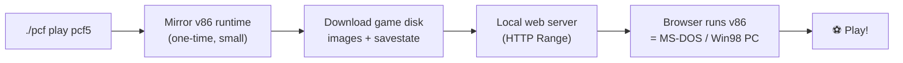
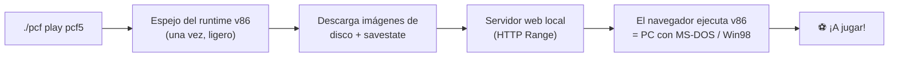

<div align="center">

# ⚽ PC Fútbol Local

**Play the legendary [PC Fútbol](https://en.wikipedia.org/wiki/PC_F%C3%BAtbol) classics on your own computer — one command, right in your browser.**

*Juega a los míticos PC Fútbol en tu ordenador — un solo comando, en tu navegador.*

[]()
[](https://github.com/i10s/pc-futbol-local/actions/workflows/ci.yml)
[](LICENSE)
[]()
[](https://github.com/copy/v86)

[English](#-english) · [Español](#-español) · [Full guide / Guía completa](docs/)

</div>

---

> **TL;DR**
> ```bash
> git clone https://github.com/i10s/pc-futbol-local.git
> cd pc-futbol-local
> ./pcf play pcf5          # Windows:  .\pcf.ps1 play pcf5
> ```
> The game downloads itself and opens in your browser. That's it. 🎉

---

## 🇬🇧 English

### What is this?

A tiny, friendly launcher that lets **anyone** play the classic Spanish football
manager **PC Fútbol** (and PC Basket, PC Calcio…) locally on **macOS, Linux or
Windows**. No accounts, no installers, no fiddling with DOSBox.

Under the hood it runs the original MS-DOS / Windows 98 games inside the
[**v86**](https://github.com/copy/v86) PC emulator in your browser — exactly the
same technology the official site uses — but **served locally from your own
machine** so you can play offline, like in the old days.

> 📦 **No game files live in this repository.** The launcher downloads them on
> demand from the **official, free** servers run by the rights holders
> (<https://online.dinamicmultimedia.es>). See [DISCLAIMER.md](DISCLAIMER.md).

### Requirements

| Tool        | macOS / Linux        | Windows                          |
| ----------- | -------------------- | -------------------------------- |
| `curl`      | preinstalled         | preinstalled (Windows 10+)       |
| Python 3    | preinstalled / brew  | recommended (built-in fallback)  |
| A browser   | any modern browser   | any modern browser               |

Check everything is fine: `./pcf doctor`

> 🐧 **Linux**: most distros already ship `curl`, `python3` and a browser. If
> something is missing, `./pcf doctor` prints the exact install command for your
> distro (`apt`/`dnf`/`pacman`/`zypper`/`apk`). You can also add a launcher to
> your applications menu with `./pcf install-desktop`. **WSL** works too.

### Quick start

**macOS / Linux**
```bash
git clone https://github.com/i10s/pc-futbol-local.git
cd pc-futbol-local
./pcf list          # see every available game
./pcf play pcf5     # download (once) + play PC Fútbol 5.0
```

**Windows (PowerShell)**
```powershell
git clone https://github.com/i10s/pc-futbol-local.git
cd pc-futbol-local
.\pcf.ps1 list
.\pcf.ps1 play pcf5
```

The first time you launch a game it downloads its disk images (this can be a few
hundred MB to ~2 GB depending on the title). After that it's **fully offline and
instant**. Your in-game saved games are kept in your browser.

### Commands

| Command              | What it does                                         |
| -------------------- | ---------------------------------------------------- |
| `pcf play <id>`      | Download if needed, then play in your browser        |
| `pcf list`           | List every game and its id (● = already downloaded)  |
| `pcf get <id>`       | Pre-download a game for offline play (no launch)     |
| `pcf menu`           | Open the game menu in your browser                   |
| `pcf update`         | Refresh the local emulator runtime                   |
| `pcf install-desktop`| **(Linux)** add an app launcher to your menu         |
| `pcf doctor`         | Check your environment                               |
| `pcf clean`          | Remove all downloaded data                           |

> 💡 Tip: set `PCF_PORT` to change the base port, or `PCF_NO_OPEN=1` to skip
> opening the browser automatically. A free port is picked automatically, so you
> can run several games at once.

> 🌐 **Be a good neighbour.** To avoid hammering the official servers you can
> download from a community **Cloudflare** mirror: set `PCF_MIRROR=https://…`
> (or ship a `data/mirror.json` so it's the default for everyone), and throttle
> with `PCF_RATE_LIMIT=3M`. Downloads are cached locally and resumed, so each
> game is only fetched once. See [mirror/cloudflare/](mirror/cloudflare/).
>
> ✅ **Already on by default.** This repo ships a live mirror
> (`pcf-mirror.ifuentes.workers.dev`, proxy + edge cache), so disk images come
> from Cloudflare out of the box — the official origin is hit at most once per
> file. To bypass it, set `PCF_MIRROR=https://discos.dinamicmultimedia.es`.

| id           | Year | Game                                          | Approx. size |
| ------------ | ---- | --------------------------------------------- | ------------ |
| `pcf4`       | 1995 | PC Fútbol 4.0                                 | ~0.5 GB      |
| `pcf5`       | 1996 | **PC Fútbol 5.0**                             | ~1.4 GB      |
| `pcf6`       | 1997 | PC Fútbol 6.0                                 | ~1.8 GB      |
| `pcf7`       | 1998 | PC Fútbol 7.0                                 | ~2.1 GB      |
| `pcf7mod`    | 1998 | PC Fútbol 7.0 · Update 25/26                  | ~2.1 GB      |
| `pcfa96`     | 1996 | PC Fútbol 4.0 · Apertura '96 (Argentina)      | ~0.5 GB      |
| `pccalcio`   | 1996 | PC Calcio 4.0                                 | ~0.5 GB      |
| `euro96`     | 1996 | PC Selección Española · Eurocopa '96          | ~0.5 GB      |
| `wc98`       | 1998 | PC Selección Española · Mundial '98           | ~1.3 GB      |
| `pcbasket`   | 1996 | PC Basket 4.0                                 | ~0.5 GB      |
| `pcbasket65` | 1999 | PC Basket 6.5                                 | ~1.6 GB      |

### How it works



More detail in the [full English guide](docs/en.md).

### Troubleshooting

- **Port already in use** → `PCF_PORT=9000 ./pcf play pcf5`
- **Black screen / no boot** → make sure the download finished (`./pcf get <id>`)
  and try a hard refresh in the browser.
- **No sound** → click once inside the game; browsers require a user gesture to
  start audio.
- **Saved games disappeared** → they live in your browser's storage for that
  `localhost` site; don't clear site data and use the same browser.

---

## 🇪🇸 Español

### ¿Qué es esto?

Un lanzador pequeño y sencillo para que **cualquiera** pueda jugar al mítico
manager de fútbol **PC Fútbol** (y PC Basket, PC Calcio…) en local en **macOS,
Linux o Windows**. Sin cuentas, sin instaladores, sin pelearte con DOSBox.

Por dentro ejecuta los juegos originales de MS-DOS / Windows 98 dentro del
emulador de PC [**v86**](https://github.com/copy/v86) en tu navegador —la misma
tecnología que usa la web oficial— pero **servido localmente desde tu propio
ordenador**, para que puedas jugar offline, como en los viejos tiempos.

> 📦 **Este repositorio no contiene ningún juego.** El lanzador los descarga
> bajo demanda desde los servidores **oficiales y gratuitos** de los titulares
> de derechos (<https://online.dinamicmultimedia.es>). Lee
> [DISCLAIMER.md](DISCLAIMER.md).

### Requisitos

| Herramienta | macOS / Linux        | Windows                            |
| ----------- | -------------------- | ---------------------------------- |
| `curl`      | preinstalado         | preinstalado (Windows 10+)         |
| Python 3    | preinstalado / brew  | recomendado (hay alternativa)      |
| Navegador   | cualquiera moderno   | cualquiera moderno                 |

Comprueba que todo está bien: `./pcf doctor`

> 🐧 **Linux**: la mayoría de distros ya traen `curl`, `python3` y un navegador.
> Si falta algo, `./pcf doctor` te dice el comando exacto para tu distro
> (`apt`/`dnf`/`pacman`/`zypper`/`apk`). También puedes añadir un acceso directo
> a tu menú de aplicaciones con `./pcf install-desktop`. **WSL** también funciona.

### Inicio rápido

**macOS / Linux**
```bash
git clone https://github.com/i10s/pc-futbol-local.git
cd pc-futbol-local
./pcf list          # ver todos los juegos disponibles
./pcf play pcf5     # descargar (una vez) + jugar a PC Fútbol 5.0
```

**Windows (PowerShell)**
```powershell
git clone https://github.com/i10s/pc-futbol-local.git
cd pc-futbol-local
.\pcf.ps1 list
.\pcf.ps1 play pcf5
```

La primera vez que abres un juego se descargan sus imágenes de disco (desde unos
cientos de MB hasta ~2 GB según el título). A partir de ahí es **totalmente
offline e instantáneo**. Tus partidas guardadas se conservan en el navegador.

### Comandos

| Comando              | Qué hace                                                 |
| -------------------- | -------------------------------------------------------- |
| `pcf play <id>`      | Descarga si hace falta y juega en el navegador           |
| `pcf list`           | Lista los juegos y sus id (● = ya descargado)            |
| `pcf get <id>`       | Descarga un juego para jugar offline (sin abrirlo)       |
| `pcf menu`           | Abre el menú de juegos en el navegador                   |
| `pcf update`         | Actualiza el runtime del emulador                        |
| `pcf install-desktop`| **(Linux)** añade un acceso directo a tu menú de apps    |
| `pcf doctor`         | Comprueba tu entorno                                     |
| `pcf clean`          | Borra todo lo descargado                                 |

> 💡 Truco: usa `PCF_PORT` para cambiar el puerto base, o `PCF_NO_OPEN=1` para
> no abrir el navegador automáticamente. El puerto libre se elige solo, así que
> puedes tener varios juegos a la vez.

> 🌐 **Sé buen vecino.** Para no saturar los servidores oficiales puedes
> descargar desde un mirror comunitario en **Cloudflare**: define
> `PCF_MIRROR=https://…` (o incluye un `data/mirror.json` para que sea el valor
> por defecto de todos) y limita la velocidad con `PCF_RATE_LIMIT=3M`. Las
> descargas se cachean en local y se reanudan, así cada juego se baja una sola
> vez. Mira [mirror/cloudflare/](mirror/cloudflare/).
>
> ✅ **Ya activo por defecto.** Este repo incluye un mirror en marcha
> (`pcf-mirror.ifuentes.workers.dev`, proxy + caché en el edge), así que las
> imágenes de disco vienen de Cloudflare desde el primer momento — el origen
> oficial se toca como mucho una vez por fichero. Para saltártelo, usa
> `PCF_MIRROR=https://discos.dinamicmultimedia.es`.

| id           | Año  | Juego                                         | Tamaño aprox. |
| ------------ | ---- | --------------------------------------------- | ------------- |
| `pcf4`       | 1995 | PC Fútbol 4.0                                 | ~0,5 GB       |
| `pcf5`       | 1996 | **PC Fútbol 5.0**                             | ~1,4 GB       |
| `pcf6`       | 1997 | PC Fútbol 6.0                                 | ~1,8 GB       |
| `pcf7`       | 1998 | PC Fútbol 7.0                                 | ~2,1 GB       |
| `pcf7mod`    | 1998 | PC Fútbol 7.0 · Actualización 25/26           | ~2,1 GB       |
| `pcfa96`     | 1996 | PC Fútbol 4.0 · Apertura '96 (Argentina)      | ~0,5 GB       |
| `pccalcio`   | 1996 | PC Calcio 4.0                                 | ~0,5 GB       |
| `euro96`     | 1996 | PC Selección Española · Eurocopa '96          | ~0,5 GB       |
| `wc98`       | 1998 | PC Selección Española · Mundial '98           | ~1,3 GB       |
| `pcbasket`   | 1996 | PC Basket 4.0                                 | ~0,5 GB       |
| `pcbasket65` | 1999 | PC Basket 6.5                                 | ~1,6 GB       |

### Cómo funciona



Más detalle en la [guía completa en español](docs/es.md).

### Problemas comunes

- **Puerto ocupado** → `PCF_PORT=9000 ./pcf play pcf5`
- **Pantalla negra / no arranca** → asegúrate de que la descarga terminó
  (`./pcf get <id>`) y recarga la página forzando (hard refresh).
- **Sin sonido** → haz clic dentro del juego; los navegadores exigen una
  interacción del usuario para iniciar el audio.
- **Se borraron las partidas** → viven en el almacenamiento del navegador para
  ese sitio `localhost`; no borres los datos del sitio y usa el mismo navegador.

---

## 🤝 Contributing / Comunidad

Contributions are very welcome! · ¡Las contribuciones son muy bienvenidas!

- 📋 Read the [Contributing guide](CONTRIBUTING.md) (EN/ES) and the
  [Code of Conduct](CODE_OF_CONDUCT.md).
- 🐛 Found a bug or want a game added? Open an [issue](https://github.com/i10s/pc-futbol-local/issues/new/choose).
- 🔒 Security reports: see [SECURITY.md](SECURITY.md).
- 📝 Changes are tracked in the [CHANGELOG](CHANGELOG.md).

For developers:

```bash
make lint     # ShellCheck + Python syntax
make check    # validate data/games.json
make test     # hermetic HTTP Range self-test (no downloads)
make all      # everything CI runs
```

---

<div align="center">

Hecho con ❤️ para la comunidad de PC Fútbol · Made with ❤️ for the PC Fútbol community

Games © Dinamic Multimedia / FX Interactive · Emulator © the [v86](https://github.com/copy/v86) project

</div>
